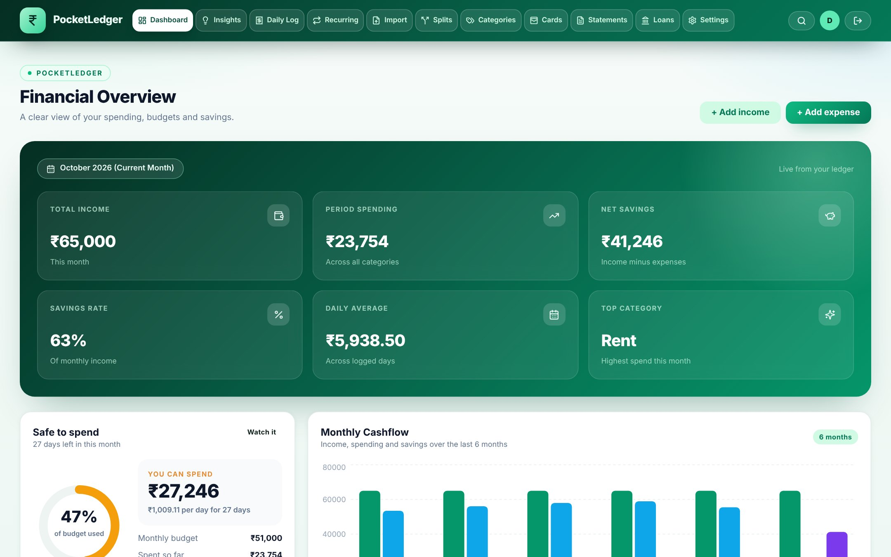
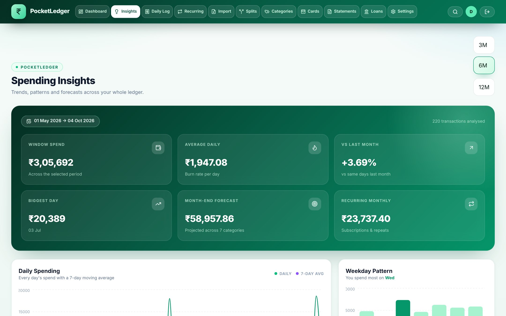
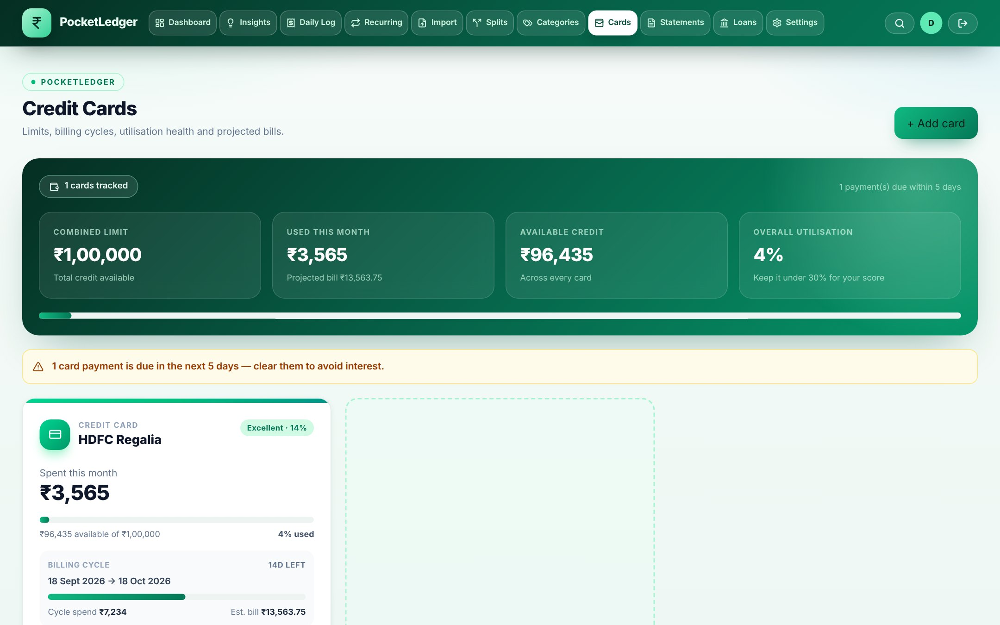
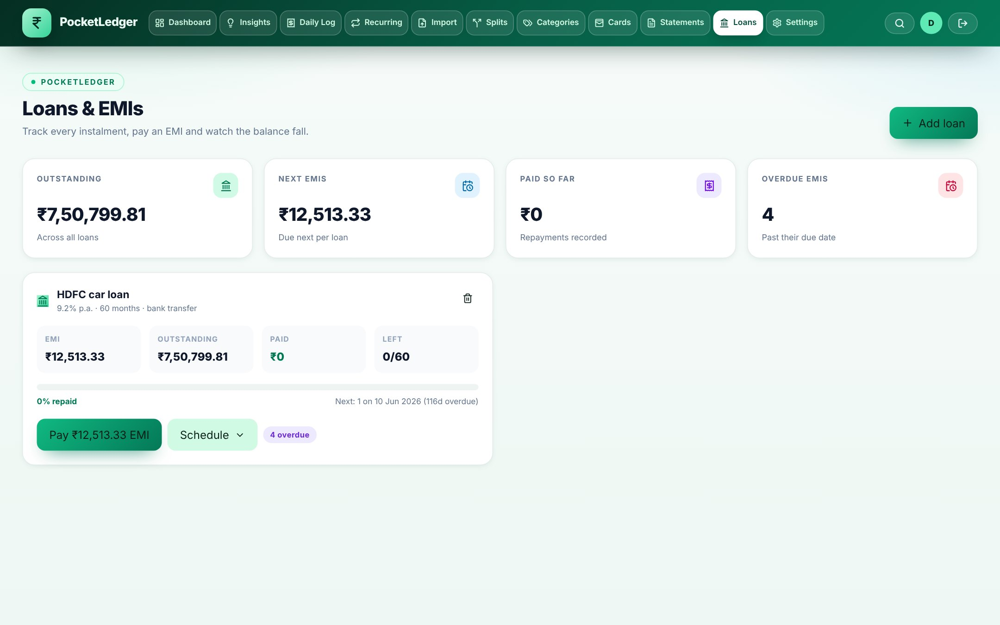
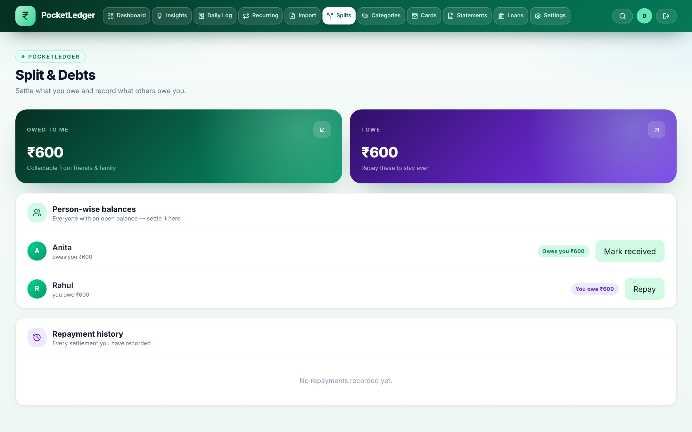
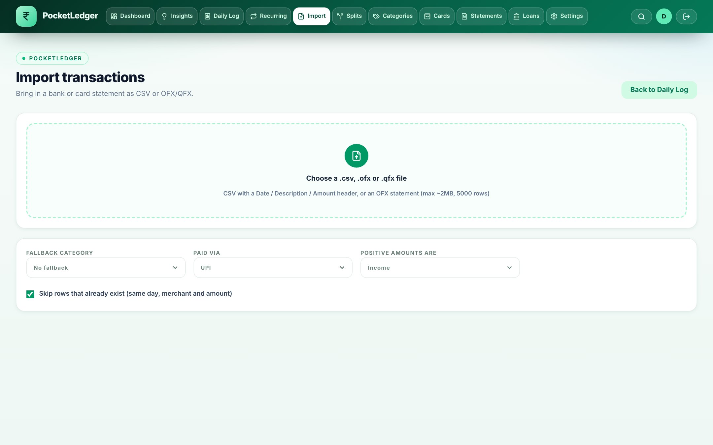
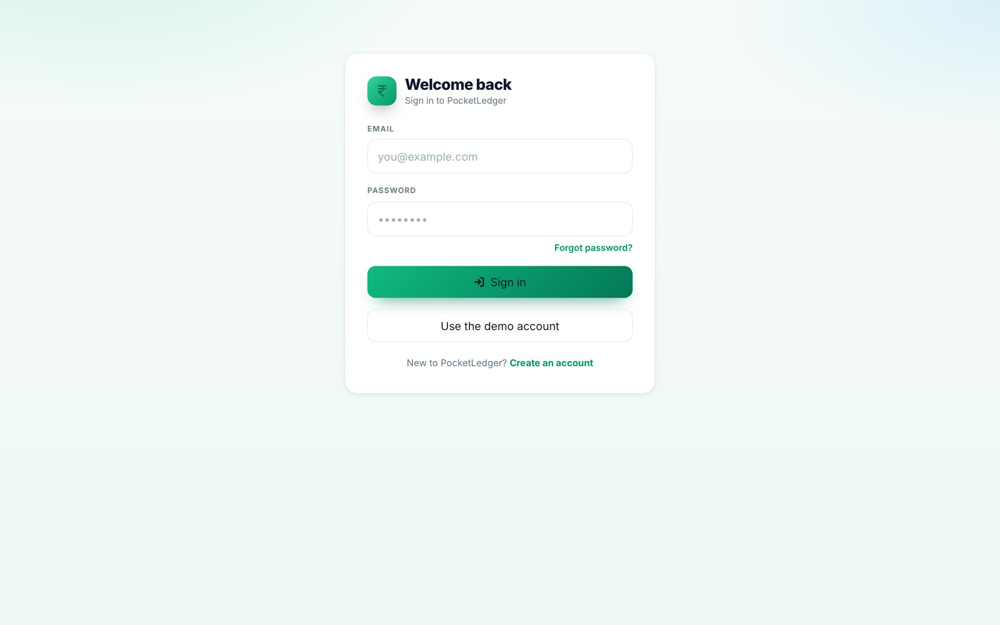

<div align="center">


# PocketLedger

**The open-source personal finance tracker you run yourself.**

Expenses · budgets · insights · credit cards · EMIs · shared households —
no subscriptions, no ads, and **no data ever leaves your server**.

[](LICENSE)
[](https://nodejs.org)
[](https://nextjs.org)
[](https://www.postgresql.org)
[](#testing--ci)
[](https://github.com/vishal-ravi/PocketLedger/actions/workflows/ci.yml)

[Features](#features) · [Quick start](#quick-start) · [Screenshots](#screenshots) · [Testing](#testing--ci) · [Contributing](#contributing)



</div>

---

## Why PocketLedger?

Most finance apps want your bank credentials and charge you monthly for your own data.
PocketLedger takes the opposite view: it is a full-featured tracker that **you host**, with a
one-command Docker setup, a real test suite, and a security posture you can read line by line.

- **🔒 Private by construction** — self-hosted Postgres, HTTP-only signed sessions, per-account data isolation, zero third-party trackers at runtime.
- **📈 Serious analysis** — not just a ledger: safe-to-spend budgets, spend pace and streaks, recurring-charge detection, credit-card health, amortised EMI schedules and month-end forecasts.
- **🛠 Built like a product** — strict TypeScript, Zod-validated APIs, Prisma Migrate, structured logs, health checks, 97 unit tests and a 271-check browser QA suite in CI.

## Screenshots

<table>
  <tr>
    <td width="50%"></td>
    <td width="50%"></td>
  </tr>
  <tr>
    <td></td>
    <td></td>
  </tr>
  <tr>
    <td></td>
    <td></td>
  </tr>
</table>

## Features

**Tracking**
- Expense CRUD with an advanced entry modal — quick modes, split a bill, “paid for someone”
- Need / Want / Income tagging, per-category budgets with **rollover**, and actual-vs-budget views
- Multi-currency entries: original amount, currency code and FX rate stored alongside the home-currency total
- Paginated ledger with date-range, month and text filters plus CSV export of the filtered view
- Bill splits with per-person balances; repay oldest-first (or in part) with per-record undo

**Dashboard**
- KPI strip (income, spending, savings rate, daily average, top category) for the current month
- Safe-to-spend ring: budget utilisation, per-day allowance for the days left, month-end projection
- Pace & habit alerts — flags a 15%+ overshoot vs your usual daily spend, plus no-spend / capped-day / logged-day streaks
- Monthly cashflow bars, payment-mix donut, top-category bars, upcoming EMIs, card due dates and a shared-bills strip
- Inline quick-add that refreshes the dashboard, savings goals with monthly pacing

**Insights** (`/insights`)
- Daily spend with a 7-day moving average, weekday spending pattern, 6-month category trends
- Spend-vs-income, month-over-month delta, biggest transactions, month-end forecast per budget

**Credit cards** (`/cards`) & statements (`/statements`)
- Combined limit and utilisation band; billing-cycle spend with statement/due countdowns
- Projected bill, minimum due, rewards estimate and interest cost if you roll the bill over (APR-based)
- Per-card 6-month trend and category split; monthly statement pages per card

**Loans & EMIs** (`/loans`)
- Amortised EMI schedule (last instalment absorbs rounding), outstanding balance, paid/overdue counts, live EMI preview while you type
- Pay an instalment → writes a `NEED` expense into the ledger automatically

**Recurring** (`/recurring`)
- Detected monthly commitments (Netflix, rent, gym…) with next-due dates, plus manual rules you can post

**Import** (`/import`)
- CSV **and** OFX bank-statement import with row-level validation and issue reporting before anything is written

**Households**
- Invite codes with owner/member roles — a shared ledger both people can write, while profile, password, 2FA and personal budgets stay private
- Shared expenses appear in both members’ dashboards, insights and category views

**Security**
- Passwords hashed with `scrypt`; sessions are a signed, HTTP-only JWT cookie (30 days) verified by middleware on **every** page and API route
- Password reset via emailed link with account-enumeration-safe responses; session revocation (`tokenVersion`) on reset or “log out of all devices”
- TOTP **two-factor authentication** with backup codes (hand-rolled RFC 6238 on `node:crypto` — no extra dependency)
- Sliding-window rate limits + 15-minute lockout after 5 failed logins; hardened headers (nosniff, frame-deny, referrer policy, HSTS, permissions policy), no `x-powered-by`

**Productivity & ops**
- ⌘K / Ctrl-K command palette, installable **PWA** (service worker + manifest), responsive layout
- `GET /api/health`, structured JSON logs, JSON backup/restore, seed guards in production
- File mailer by default (links land in `logs/mail/outbox.log`) — switch to SMTP or any webhook

## Tech stack

| Layer | Choice |
| --- | --- |
| Framework | Next.js 15 (App Router, Route Handlers) + React 19 |
| Language | TypeScript (strict), ESLint (next/core-web-vitals) |
| Data | PostgreSQL + Prisma ORM — 11 versioned migrations, never `db push` in prod |
| Validation | Zod schemas for every request body (`lib/validation.ts`) |
| Auth | `jose` JWT cookie + middleware, `scrypt` hashing, TOTP via `node:crypto` |
| Styling | Tailwind CSS v4 |
| Charts | Recharts |
| Email | nodemailer SMTP · webhook · file outbox (default) |
| Testing | `node:test` unit suite + Puppeteer browser QA (271 checks) |
| Shipping | Multi-stage Dockerfile (standalone output) + Docker Compose, GitHub Actions CI |

## Quick start

### 🐳 Docker (recommended)

```bash
git clone https://github.com/vishal-ravi/PocketLedger.git pocketledger && cd pocketledger

# compose reads .env for interpolation — AUTH_SECRET is required
cp .env.example .env
echo "AUTH_SECRET=$(openssl rand -hex 32)" >> .env

docker compose up -d --build     # migrations run automatically on start
docker compose run --rm seed     # optional demo data
```

Open **http://localhost:3000** — the login page has a *Use the demo account* button
(`demo@example.com` / `demo12345`).

Day-to-day:

```bash
docker compose logs -f app                                              # structured logs
docker compose up -d --build                                            # deploy an update
docker compose exec db pg_dump -U postgres > pocketledger-$(date +%F).sql # backup
```

The database stays inside the compose network (host port not published); data lives in the
`pgdata` volume. On a LAN keep `COOKIE_SECURE=0`; behind an HTTPS reverse proxy set
`APP_URL=https://…` and `COOKIE_SECURE=1`.

### 💻 From source

```bash
npm install
cp .env.example .env        # set DATABASE_URL and AUTH_SECRET
npx prisma migrate deploy   # applies prisma/migrations (fresh DB included)
npm run db:seed             # demo account + sample categories/cards/loans
npm run dev                 # http://localhost:3000
```

Requires Node.js 22+ and PostgreSQL 14+.

## Commands

| Command | What it does |
| --- | --- |
| `npm run dev` / `build` / `start` | Develop · production build · serve |
| `npm run lint` · `npx tsc --noEmit` | ESLint · strict type check |
| `npm run test:unit` | 97 unit tests (`node:test` over `lib/`) |
| `npm run test:qa` | 271-check browser suite (needs Chrome: `CHROME_PATH=…`) |
| `npm run test` | unit + QA |
| `npm run db:migrate` | create/apply a migration in dev |
| `npm run db:migrate:deploy` | apply migrations (production) |
| `npm run db:seed` | idempotent demo data |
| `npm run db:demo-history` / `db:clear-demo-history` | add / remove ~223 sample transactions |
| `npm run db:backup` / `db:restore -- <dir> --force` | JSON snapshot / restore |
| `docker compose up -d --build` | build + ship the stack |

## Testing & CI

- **Unit** — 97 tests over `lib/` (loans, statements, TOTP, import, FX, household, rate-limit…): `npm run test:unit`
- **End-to-end** — Puppeteer walks every flow: signup, budgets,
  insights, cards, loans, splits, import, recurring, statements, households, 2FA, security probes… **271/271**
- **GitHub Actions** (`.github/workflows/ci.yml`) runs three jobs on each push:
  `quality` (lint → types → unit → build) · `e2e` (Postgres service + Chrome) · `docker` (image build)

## Configuration

| Variable | Purpose | Default |
| --- | --- | --- |
| `DATABASE_URL` | Postgres connection string | — (required) |
| `AUTH_SECRET` | Signs session cookies (≥ 32 random bytes) | — (required) |
| `APP_URL` | Absolute base URL for emailed links | `http://localhost:3000` |
| `COOKIE_SECURE` | Set `1` behind HTTPS | `0` |
| `LOG_LEVEL` | `debug` \| `info` \| `warn` \| `error` | `info` |
| `MAIL_TRANSPORT` | `file` \| `smtp` \| `webhook` | `file` |
| `SMTP_URL` / `MAIL_WEBHOOK_URL` | Delivery when not using the file outbox | — |
| `ALLOW_SEED` | Must be `1` to seed in production | `0` |
| `APP_PORT`, `POSTGRES_PASSWORD` | Compose-only host port / DB password | `3000` / `change-me` |

Backups: `npm run db:backup` (JSON) or
`docker compose exec db pg_dump -U postgres > …sql`. Health: `GET /api/health` →
`{status, db, uptime}`.

## Project structure

```
app/                  # App Router pages + 47 API routes (Zod-validated bodies)
  api/                #   auth, expenses, budgets, analytics, household, 2fa, import…
  insights|cards|loans|splits|statements|import|recurring|budgets
components/           # UI: navbar, modals, command palette, PWA register…
lib/                  # domain logic: budgets, loans, statements, import, totp, fx…
prisma/               # schema + migrations + seed scripts
tests/                # unit suite (node:test)
qa.mjs                # end-to-end browser suite (Puppeteer)
docs/screenshots/     # README images
docker-compose.yml    # app + Postgres 16, migrations on boot
```

## Contributing

Issues and PRs are welcome — [open an issue](https://github.com/vishal-ravi/PocketLedger/issues)
or fork and send a PR. To iterate locally:

```bash
npm run lint && npx tsc --noEmit && npm run test:unit   # must be clean
CHROME_PATH=/path/to/chrome npm run test:qa             # 271/271
```

Please keep migrations additive, validate new routes with Zod, and add tests for `lib/` logic.

## Roadmap

1. OAuth login (Google/Apple) on top of the existing session layer
2. Notifications for upcoming card dues and budget overspend
3. PDF export for monthly statements and reports
4. Redis-backed rate limiting + Sentry when running multiple instances
5. Recurring-rule auto-posting as a scheduled job

## License

Licensed under the [Apache License 2.0](LICENSE) — use it, modify it, ship it; keep the notice.
